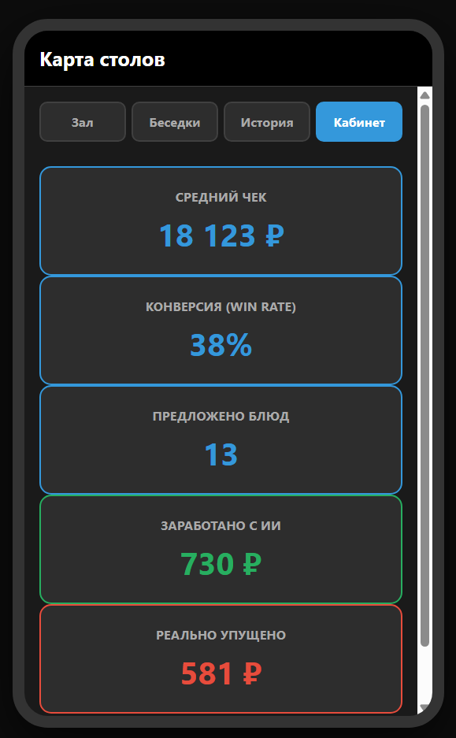

# Digital-Дирижёр

## Restaurant Sales Intelligence & Waiter Copilot

Digital-Дирижёр — offline-first PWA для HoReCa, созданное как инструмент повышения продаж и стандартизации работы официантов.

Главная идея проекта — не просто принимать заказы, а помогать официанту продавать эффективнее в реальном времени и одновременно превращать результат его работы в измеримую аналитику.

## Как работает система

Заказ  
→ Анализ контекста  
→ Рекомендация для допродажи  
→ Действие официанта  
→ Продажа / отказ  
→ Аналитика сотрудника  
→ Управленческий вывод

## Уже реализовано

- управление столами и заказами;
- разделение позиций по гостям и курсам;
- работа с весовыми позициями;
- статусы отправки и подачи;
- таймеры ожидания;
- история чеков;
- offline-first архитектура;
- contextual upsell recommendation engine;
- учёт показанных рекомендаций;
- учёт принятых и отклонённых рекомендаций;
- расчёт дополнительной выручки;
- оценка потенциально упущенных продаж;
- расчёт conversion / win rate;
- аналитика по сотрудникам и периодам.

## Recommendation Engine

Система анализирует текущий заказ и формирует контекстные рекомендации непосредственно во время обслуживания гостя.

В логике учитываются:

- состав заказа;
- гастрономические сочетания;
- время добавления позиции;
- стадия обслуживания;
- отдельная dessert phase;
- уже предложенные позиции;
- принятые и отклонённые рекомендации.

Коммерческая логика recommendation engine и база правил являются приватной частью проекта и не публикуются в данном showcase-репозитории.

## Бизнес-ценность

Проект создавался как инструмент, способный уменьшить зависимость результата ресторана от опыта конкретного официанта.

Официант получает подсказку непосредственно в момент продажи, а менеджмент получает данные о том:

- сколько рекомендаций было показано;
- сколько рекомендаций было принято;
- какую дополнительную выручку они принесли;
- где потенциальные продажи были упущены;
- как различается эффективность сотрудников.

Таким образом, система помогает не только увеличивать продажи, но и выявлять разницу в качестве работы разных официантов.

## Аналитика продаж

Система превращает работу с рекомендациями в измеримые бизнес-метрики.

Панель аналитики позволяет отслеживать:

- средний чек;
- конверсию рекомендаций (win rate);
- количество предложенных позиций;
- дополнительную выручку от рекомендаций;
- потенциально упущенные продажи;
- эффективность отдельных сотрудников.

Это позволяет оценивать не только общий результат ресторана, но и качество работы каждого официанта с допродажами.

## Архитектура развития / Roadmap

Следующий этап развития проекта предусматривает:

- интеграцию с ресторанными POS/RMS-системами через API;
- синхронизацию заказов и сотрудников;
- локальный mini-PC / edge-server внутри ресторана;
- работу устройств официантов внутри локальной сети;
- снижение зависимости основной операционной логики от внешнего интернета;
- отдельную административную панель;
- централизованные обновления;
- подключение внешнего контекста: погода, время суток, сезонность и зона посадки.

Потенциальные интеграции рассматриваются с системами класса iiko, r_keeper и другими платформами, предоставляющими необходимые интеграционные интерфейсы.

Целевая архитектура предполагает возможность локальной работы внутри ресторана даже при нестабильном внешнем интернете.

## Публичная версия

Этот репозиторий является публичной демонстрационной версией проекта.

Полный production prototype содержит закрытую бизнес-логику, recommendation rules, внутренние данные и коммерческие алгоритмы, которые намеренно не публикуются.

## Технологии

HTML  
CSS  
JavaScript  
PWA  
Service Worker  
LocalStorage  

AI-assisted product development
